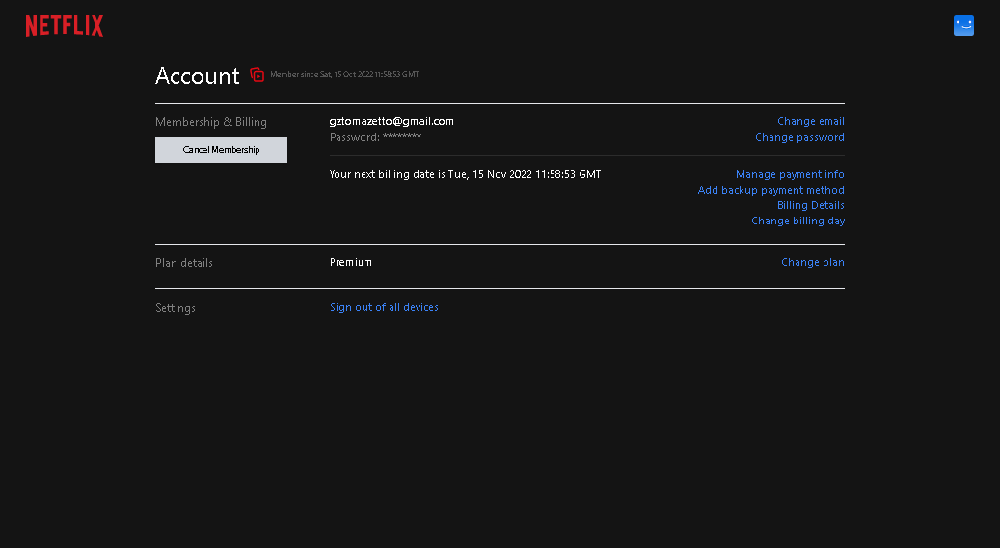

<h1 align="center"> Netflix Clone + NextJS and tailwindCss </h1>


## 🔗 Links
-[Vercel Project](https://netflix-clone-tau-nine.vercel.app/)

# :hammer: Project description

<h2> 
I recreate "Netflix" in Next.JS styled with Tailwind CSS and as a bonus we will even add Auth with Firebase and stripe for payments <br>im using TMDB api for movies and lists <a>https://www.themoviedb.org/ </a> and utilizing material UI!
</h2>

<h2>🏆 Goals </h2>

🏆 Build Netflix with Next.JS <br>
🏆 use Custom Hook for authentication<br>
🏆 material UI Component<br>
🏆 Create a fully responsive web app in Next.JS styled with Tailwind CSS<br>
🏆 Lazy loading images with the Image component<br>
🏆 Use React-PLayer <br>
🏆 Routing in Next.js<br>

# :wrench: Languages, dependencies and libs used!

- `React`
- `NextJS`
- `Recoil`
- `TailwindCSS`
- `Typescript`
- `Firebase/firestore`
- `material UI`
- `react hook form`
- `react player`
- `Stripe`
- `React hot toast`

# Login Screen


# Index Screen


# Account Screen


# Payment Screen


# Checkout Screen


## Getting Started

First install, after install run the development server:

```bash
# first
npm i
#after
npm run dev
# or
yarn dev
```